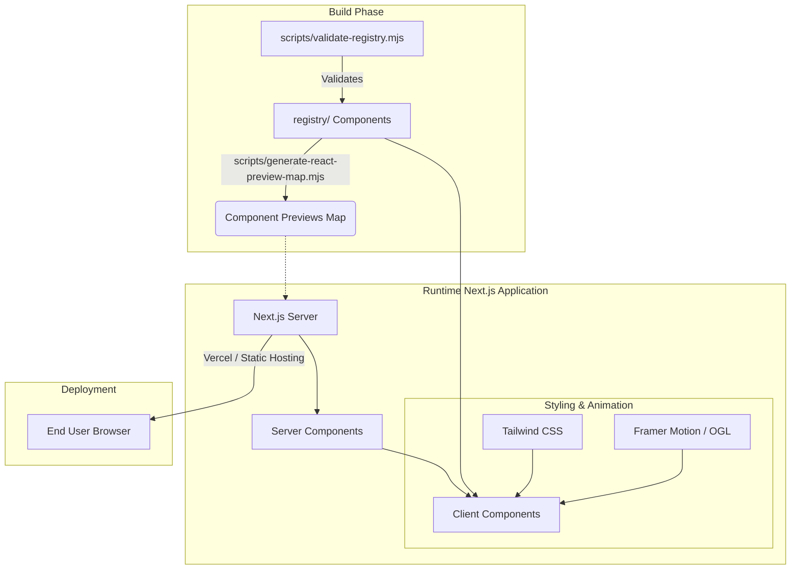

# Architecture

## 🚀 Tech Stack

- **Frontend Framework**: [Next.js](https://nextjs.org/) (App Router)
- **UI Library**: [React](https://react.dev/)
- **Styling**: [Tailwind CSS v4](https://tailwindcss.com/)
- **Animations**: [Framer Motion](https://www.framer.com/motion/) & [OGL](https://github.com/oframe/ogl)
- **Language**: [TypeScript](https://www.typescriptlang.org/)
- **Tooling**: ESLint, PostCSS

## 📂 Folder Structure

- `src/` - Core application logic, routing (Next.js App Router), and UI layouts.
- `public/` - Static assets like images, icons, and fonts.
- `registry/` - The core UI components registry where reusable Prism-Bits components are stored.
- `scripts/` - Node.js helper scripts for generating component previews and validating the registry.

## 🏗️ System Architecture

The following diagram illustrates how the different layers of Prism-Bits interact, from the build process to runtime execution.

## 🔄 Data Flow
1. **Component Registry**: Developers add new UI components to the `registry/`.
2. **Build Scripts**: During `predev` and `prebuild`, scripts map the registry components so they can be dynamically previewed in the docs.
3. **Application Layer**: Next.js renders the documentation and preview pages, consuming the generated maps.
4. **User Interaction**: Users view the live components, copy code, and interact with the UI, which is styled by Tailwind and animated by Framer Motion.

## 🌐 External Services
Currently, Prism-Bits operates as a static/hybrid frontend web application without requiring a dedicated backend database. It relies on standard hosting providers (e.g., Vercel) for deployment and serving.
